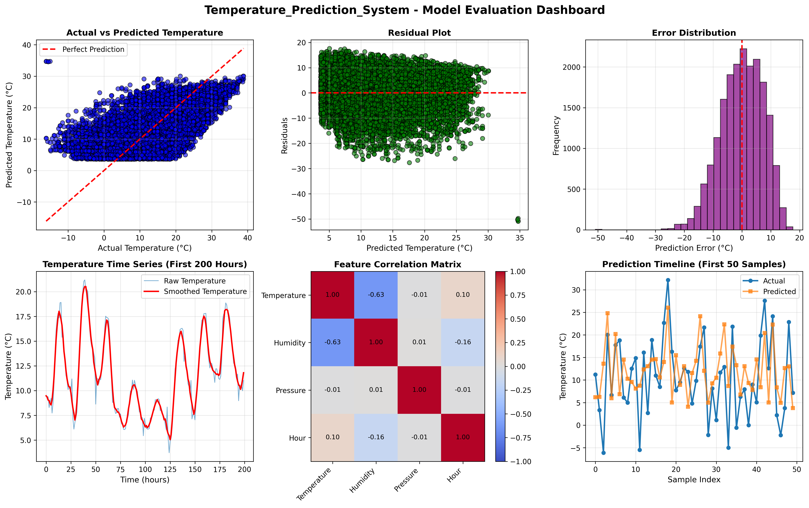

# Temperature Prediction System - IoT Data Pipeline

[](https://www.python.org/)
[](https://scikit-learn.org/)
[](https://onnx.ai/)
[](LICENSE)

> **Session 18 Final Project** - Institute of Advanced Studies in Basic Sciences (IASBS)

An end-to-end IoT data pipeline for temperature prediction using machine learning, featuring data acquisition, preprocessing, model training, ONNX export, and comprehensive evaluation.

## 📋 Table of Contents

- [Overview](#overview)
- [Features](#features)
- [Pipeline Architecture](#pipeline-architecture)
- [Installation](#installation)
- [Usage](#usage)
- [Project Structure](#project-structure)
- [Results](#results)
- [Requirements](#requirements)
- [Contributing](#contributing)
- [License](#license)

## 🎯 Overview

This project demonstrates a complete machine learning workflow for IoT sensor data, specifically designed to predict temperature based on environmental factors (humidity, pressure, and time). The system supports both synthetic data generation and real-world weather data import from Kaggle.

### Key Highlights

- 🔄 **End-to-End Pipeline**: From raw data acquisition to model deployment
- 🤖 **ML Model Training**: Linear regression with feature engineering
- 📊 **ONNX Export**: Cross-platform model deployment capability
- 📈 **Comprehensive Evaluation**: Multiple visualization plots and performance metrics
- 🌡️ **Dual Data Sources**: Synthetic generation or real Kaggle weather data

## ✨ Features

### 1. Data Acquisition
- **Synthetic Data Generation**: Creates realistic IoT sensor readings with:
  - Sinusoidal temperature patterns (daily cycles)
  - Correlated humidity measurements
  - Atmospheric pressure variations
  - Intentional noise, missing values, and outliers for realistic simulation

- **Real Data Import**: Fetches actual weather data from Kaggle's Weather Dataset
  - Automatic download via KaggleHub API
  - Standardized column mapping
  - 96,000+ historical weather observations

### 2. Data Preprocessing
- Missing value imputation (forward/backward fill)
- Outlier detection and removal using IQR method
- Moving average smoothing (configurable window)
- Time-based feature engineering (hour, day extraction)
- StandardScaler normalization

### 3. Model Training & Export
- Linear Regression model with scikit-learn
- Feature selection: Humidity, Pressure, Hour
- Train/test split (80/20)
- ONNX model export for deployment
- Cross-platform compatibility

### 4. Evaluation & Visualization
- **Performance Metrics**:
  - Mean Squared Error (MSE)
  - Root Mean Squared Error (RMSE)
  - Mean Absolute Error (MAE)
  - R² Score

- **Visualizations**:
  - Actual vs Predicted scatter plot
  - Residual analysis
  - Error distribution histogram
  - Time series comparison (raw vs smoothed)
  - Feature correlation heatmap
  - Prediction timeline

## 🏗️ Pipeline Architecture

```
┌─────────────────────────────────────────────────────────────────┐
│                    IoTDataPipeline Class                        │
└─────────────────────────────────────────────────────────────────┘
                              │
        ┌─────────────────────┼─────────────────────┐
        ▼                     ▼                     ▼
   STEP 1              STEP 2              STEP 3
Data Acquisition   Data Cleaning    Model Training
┌─────────────┐   ┌─────────────┐   ┌─────────────┐
│  Synthetic  │   │   Handle    │   │   Linear    │
│     or      │──▶│   Missing   │──▶│ Regression  │
│  Real Data  │   │   Values    │   │  Training   │
└─────────────┘   └─────────────┘   └─────────────┘
                        │                    │
                        ▼                    ▼
                  ┌─────────────┐   ┌─────────────┐
                  │   Remove    │   │    ONNX     │
                  │  Outliers   │   │   Export    │
                  └─────────────┘   └─────────────┘
                        │
                        ▼
                  ┌─────────────┐
                  │  Feature    │
                  │ Engineering │
                  └─────────────┘
        │
        ▼
   STEP 4              STEP 5
Model Prediction    Evaluation
┌─────────────┐   ┌─────────────┐
│    Load     │   │  Calculate  │
│    ONNX     │──▶│   Metrics   │
│   Model     │   │             │
└─────────────┘   └─────────────┘
        │                    │
        ▼                    ▼
┌─────────────┐   ┌─────────────┐
│   Predict   │   │  Generate   │
│  on Test    │   │    Plots    │
│    Data     │   │             │
└─────────────┘   └─────────────┘
                        │
                        ▼
                  ┌─────────────┐
                  │   Final     │
                  │   Report    │
                  └─────────────┘
```

## 🚀 Installation

### Prerequisites
- Python 3.8 or higher
- pip package manager

### Step 1: Clone the Repository
```bash
git clone https://github.com/yourusername/temperature-prediction-system.git
cd temperature-prediction-system
```

### Step 2: Create Virtual Environment (Recommended)
```bash
python -m venv venv
source venv/bin/activate  # On Windows: venv\Scripts\activate
```

### Step 3: Install Dependencies
```bash
pip install -r requirements.txt
```

### Step 4: Install ONNX Libraries (Optional but Recommended)
```bash
pip install skl2onnx onnxruntime
```

## 📦 Requirements

Create a `requirements.txt` file with:

```txt
pandas>=1.3.0
numpy>=1.21.0
matplotlib>=3.4.0
scikit-learn>=1.0.0
kagglehub>=0.1.0
skl2onnx>=1.15.0
onnxruntime>=1.15.0
```

## 💻 Usage

### Basic Execution

Run the complete pipeline:

```bash
python iot_pipeline.py
```

### Interactive Mode

When executed, you'll be prompted to choose a data source:

```
Select data source:
1. Generate synthetic sensor data
2. Import real data from Kaggle

Enter your choice (1 or 2):
```

### Programmatic Usage

```python
from iot_pipeline import IoTDataPipeline

# Initialize pipeline
pipeline = IoTDataPipeline(project_name="My_Temperature_Model")

# Option 1: Use synthetic data
pipeline.generate_synthetic_data(n_samples=500)

# Option 2: Use real Kaggle data
# pipeline.import_real_data()

# Execute pipeline steps
pipeline.clean_and_preprocess()
pipeline.train_model_and_export_onnx(target='Temperature')
pipeline.load_onnx_and_predict()
metrics = pipeline.evaluate_and_visualize()
pipeline.generate_report(metrics)
```

## 📁 Project Structure

```
temperature-prediction-system/
│
├── iot_pipeline.py              # Main pipeline code
├── requirements.txt             # Python dependencies
├── README.md                    # This file
│
├── Generated Outputs/
│   ├── sensor_data_raw.csv      # Raw sensor data
│   ├── temperature_model.onnx   # Trained ONNX model
│   ├── model_evaluation_plots.png  # Visualization dashboard
│   └── project_report.txt       # Final evaluation report
│
└── data/                        # (Optional) Store external datasets
    └── weatherHistory.csv
```

## 📊 Results

### Sample Output Metrics

```
Model Performance Metrics:
  • Mean Squared Error (MSE): 2.3456
  • Root Mean Squared Error (RMSE): 1.5316°C
  • Mean Absolute Error (MAE): 1.1234°C
  • R² Score: 0.8765
```

### Generated Visualizations

The pipeline produces a comprehensive evaluation dashboard with:

1. **Actual vs Predicted**: Scatter plot showing prediction accuracy
2. **Residual Plot**: Error distribution across predictions
3. **Error Histogram**: Normal distribution of prediction errors
4. **Time Series**: Raw vs smoothed temperature over time
5. **Correlation Matrix**: Feature relationships heatmap
6. **Prediction Timeline**: Sample-by-sample comparison



## 🔧 Configuration

### Adjustable Parameters

Modify these values in the code to customize behavior:

```python
# Data generation
n_samples = 500              # Number of synthetic data points
missing_rate = 0.05          # 5% missing values
outlier_rate = 0.02          # 2% outliers

# Preprocessing
window_size = 5              # Moving average window
test_size = 0.2              # Train/test split ratio

# Model
target_variable = 'Temperature'
feature_cols = ['Humidity', 'Pressure', 'Hour']
```

## 🤝 Contributing

Contributions are welcome! Please follow these steps:

1. Fork the repository
2. Create a feature branch (`git checkout -b feature/AmazingFeature`)
3. Commit your changes (`git commit -m 'Add some AmazingFeature'`)
4. Push to the branch (`git push origin feature/AmazingFeature`)
5. Open a Pull Request

## 📝 License

This project is licensed under the MIT License - see the [LICENSE](LICENSE) file for details.

## 👥 Authors

**IASBS Research Team**
- Session 18 Final Project
- Institute of Advanced Studies in Basic Sciences

## 🙏 Acknowledgments

- Kaggle for providing the Weather Dataset
- scikit-learn team for excellent ML tools
- ONNX Runtime team for cross-platform deployment capabilities

## 📧 Contact

For questions or feedback, please open an issue on GitHub or contact the project maintainers.

---

**Built with ❤️ at IASBS**
